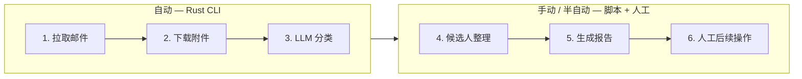

# 工作流程手册

> example-project 招聘邮件系统的完整操作流程，覆盖自动和手动部分。

---

## 流程总览



---

## 第 1 步：拉取邮件（自动）

### 触发方式

```bash
# 拉取 + 分类本月邮件（日常使用）
cargo run

# 拉取 + 分类指定月份
cargo run 2026-07

# 仅分类（已有数据，不拉取）
cargo run classify [YYYY-MM]
```

### 干了什么

| 操作 | 说明 |
|------|------|
| **分页拉取元数据** | 调用 `lark-cli mail +triage`，每页 200 封，自动翻页直到无 `page_token` |
| **筛选本月邮件** | 按 `YYYY-MM` 前缀过滤 `date` 字段 |
| **游标增量同步** | 读取 `data/YYYY-MM/.cursor`，只拉取游标之后的邮件 |
| **拉取完整正文** | 调用 `lark-cli mail +messages`，每批 20 封 |
| **下载附件** | 非内联附件下载到 `data/YYYY-MM/attachments/<msg_id>/`，先写 `.tmp` 再重命名 |

### 输出

```
data/YYYY-MM/
├── .cursor                     ← 游标（最后同步时间戳）
├── INBOX.json                  ← 收件箱元数据列表
├── INBOX.full.json             ← 收件箱完整正文
├── SENT.json                   ← 已发送元数据列表
├── SENT.full.json              ← 已发送完整正文
├── attachments/<msg_id>/       ← 附件文件
```

### 频率

每天运行一次。游标机制保证只拉新邮件，重跑不重复。

---

## 第 2 步：LLM 分类（自动）

### 触发方式

第 1 步的 `cargo run` 自动执行分类，无需手动触发。也可以通过以下命令单独执行分类：

```bash
cargo run classify        # 仅分类本月
cargo run classify 2026-07  # 仅分类指定月
```

### 分类逻辑（`src/classifier.rs`）

| 步骤 | 说明 |
|------|------|
| **筛选未分类邮件** | 对比 `.*.classification.json` 中已有的 `message_id`，只处理新邮件 |
| **分批调用 LLM** | 每批最多 30 封，调用 DeepSeek Chat API（通过 `reqwest` 直调） |
| **归类** | 每封邮件归入 6 类之一（见下方分类体系） |
| **增量保存** | 分类结果追加到 `.*.classification.json`，已有分类不受影响 |

### 分类体系

| 类别 | 含义 | 示例 |
|------|------|------|
| `resume_submission` | 简历投递 / 求职申请 | 候选人发来的求职邮件 |
| `written_exam` | 笔试题相关 | 发送笔试题、候选人提交作答 |
| `interview_scheduling` | 面试安排 | 面试邀请、时间确认 |
| `offer_letter` | 录用通知 | Offer 发放、合同、入职说明 |
| `hr_internal` | 内部 HR 通信 | 公司域名发出的内部邮件 |
| `unrelated` | 无关邮件 | 通知、广告、垃圾邮件 |

### 输出

```
data/YYYY-MM/
├── INBOX.classification.json   ← 收件箱分类结果
├── SENT.classification.json    ← 已发送分类结果
```

格式（JSON 数组，可手动编辑）：

```json
[
  {"message_id": "abc123", "classification": "resume_submission", "source": "llm", "updated_at": "2026-07-03 10:00"}
]
```

> `source` 字段标记分类来源（`llm` / `manual`），支持人工修正后修改字段值。

---

## 第 3 步：候选人整理（手动）

### 触发器

第 1 步 + 第 2 步完成后，人工执行。

### 操作

1. 运行整理脚本（如有），将邮件按发件人邮箱 + 姓名聚合为候选人档案
2. 人工核对聚合结果，修正 LLM 可能遗漏/错误的候选人归并

### 输出

```
data/journal/
├── _index.json              ← 候选人索引（邮箱 → 姓名 → 文件名）
├── <email_hash>.json        ← 每位候选人的完整邮件时间线
└── ...                      ← 约 251 个候选人档案
```

每位候选人的档案包含：
- 基本信息（邮箱、姓名）
- 全部相关邮件（收 + 发），按时间排列
- 邮件总数

---

## 第 4 步：候选人级分类与报告（半自动）

### 候选人级 LLM 分类

```bash
python scripts/classify_journal.py
```

对每位候选人的全部邮件进行整体分析，输出：

| 输出 | 说明 |
|------|------|
| **`overall_stage`** | 候选人到达的最远阶段（`resume_submission` → `exam_invitation` → `exam_submission` → `exam_result` → `interview_scheduling` → `offer_letter`） |
| **每封邮件的细分类** | 8 细类（比第 2 步的 6 类更精细，区分 `exam_invitation` / `exam_submission` / `exam_result`） |

### 漏斗报告

```bash
python scripts/funnel_report.py
```

生成 Markdown 漏斗图，包含：
- 各阶段人数及转化率
- 按日趋势
- 分类分布

### 统计导出

```bash
python scripts/export_stats.py
```

输出 `data/report/stats.json`：

```json
{
  "total_candidates": 251,
  "stage_distribution": {
    "exam_invitation": 132,
    "exam_submission": 72,
    ...
  }
}
```

### 输出目录

```
data/report/
├── stats.json                       ← 统计数据
├── classification_results.json      ← 候选人级分类结果
├── 2026-06-funnel.md                ← 漏斗报告
├── 2026-06-recruitment-funnel.md    ← 招聘漏斗
├── 2026-06-by-position.md           ← 按岗位统计
├── 2026-06-exam-signals.md          ← 笔试信号
└── generate_reports.py              ← 统一报告生成器
```

---

## 第 5 步：人工后续操作

以下操作完全手动，系统不介入：

| 操作 | 频率 | 依据 |
|------|------|------|
| **发送笔试题** | 新候选人投递后 | `resume_submission` 分类的邮件 |
| **批改笔试** | 候选人提交后 | `exam_submission` 分类的邮件 |
| **安排面试** | 笔试通过后 | 人工判断 |
| **发送 Offer** | 面试通过后 | 人工判断 |
| **更新分类** | 随时 | 直接修改 `*.classification.json` 中的 `classification` 和 `source` 字段 |

---

## 完整数据链路

```
飞书邮件
   │
   ▼  (cargo run — 自动)
data/YYYY-MM/
├── INBOX.full.json
├── INBOX.classification.json       ← Rust classifier
├── SENT.full.json
├── SENT.classification.json        ← Rust classifier
├── attachments/
│
   ▼  (scripts/classify_journal.py — 半自动)
data/journal/
├── _index.json
├── <email_hash>.json                ← 候选人时间线
│
   ▼  (scripts/*.py — 半自动)
data/report/
├── stats.json
├── classification_results.json
├── <period>-funnel.md               ← 最终报告
│
   ▼  （人工）
操作决策（发笔试题 / 面试 / Offer）
```

---

## 环境变量

| 变量 | 用途 | 默认值 |
|------|------|--------|
| `LLM_API_KEY` | LLM API 密钥 | —（必填） |
| `AI_REVIEW_MODEL` | 模型名 | `deepseek-chat` |
| `AI_REVIEW_BASE_URL` | API 端点 | `https://api.deepseek.com` |
